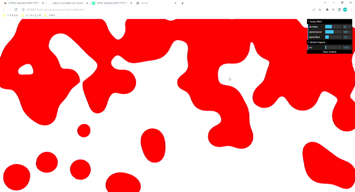

# canvas-practice-projects
Canvas를 활용한 projects

## 1. projects [Particle-page]

  - css효과를 통해 물방울이 떨어지는 effect를 만들 수 있다. 

  

## 2. projects [fire-effect]

  - 여러 particles을 2D 원형의 랜덤한 방향으로 퍼트려 불꽃놀이 effect를 만들었다.

  

## 이론

### Canvas 유의점

#### 1. Size 조절시
    - canvas style 조절만 하면 canvas의 기본 width, height = ( 300, 150 )  임으로 canvas style은 바뀌지만 내부 item의 비율이 이상해짐
    - style 보다 width,height이 작아져도 내부 item의 픽셀이 어그러짐
    => canvas.style.width,height 변경 시 canvas.width,height 도 같은 값으로 변경해야 함.
  
#### 2. 선명도 높이는 법
    -- dpr 활용법
    const dpr = window.devicePixelRatio; 
    canvas.width = canvasWidth * dpr;
    canvas.height = canvasHeight * dpr;
    // divice의 dpr 만큼 canvas를 늘려준다.

    ctx.scale(dpr,dpr);
    //style 도 늘려주니깐 보이는것 처음 설정한 것 과 같지만
    // pixel 수가 늘어났음으로 더 선명해지게 보인다.

#### 3. fps 주사율
    - 모니터 마다 주사율이 다름
      => fps 처리를 안하면 모니터 마다 내 애니메이션이 보여지는 프레임 속도가 다 다름
      => 요즘 모니터 60 ~ 240..? 이니깐 이 사이로 지정
      -- 공식= 
      전역
      let interval = 1000 / 60
      let now, delta
      let then = Date.now()

      aniamtion func 안에서
      now = Date.now() // aimation 해당 시간
      delta = now - then // 지금 시간 - 전 애니메이션 시간 
      if (delta < interval) return // 지정 interval 보다 작으면 animation 안할거임

#####  3-1  window.requestAnimationFrame() 

      메서드는 브라우저에게 수행하기를 원하는 애니메이션을 알리고 다음 리페인트 바로 전에 브라우저가 애니메이션을 업데이트할 지정된 함수를 호출하도록 요청합니다. 이 메서드는 리페인트 이전에 호출할 인수로 콜백을 받습니다.

    
      
##### 3-2 Boilerplate Code?

      - canvas size setting, 선명도, fps, animation, requestAnimationFrame 하는 부분이 현재 project에서 Boilerplate Code 로서 setting 하는 부분이기도 함

      - 컴퓨터 프로그래밍에서 보일러플레이트 또는 보일러플레이트 코드라고 부르는 것은 최소한의 변경으로 여러곳에서 재사용되며, 반복적으로 비슷한 형태를 띄는 코드를 말한다.

      -- branch class-boilerplate 와 function-boilerplate로 관리할 예정이다.

#### 4. SVG img 활용
    /* filter: blur(50px) contrast(50); */
      => css로 물방울 effect 만들 수 있음
      but, 배경에 따라 이상한 느낌이 남 
    - stdDeviation(x,y or 둘다) => blur 값
    - mode="matrix" values=~ color 값 및 contrast 값 바꿀수 있음
    -- 어려우면 svg filters 사이트 가서 찾아보쟈. 감사합니다
    https://yoksel.github.io/svg-filters/#/

#### 5. test library

  -- 

#### 6. 원 모양 방향
  - x, y 좌표는 가로 세로 직선 방향, random으로 item이 축을 따라 이동을 한다면 사각형 모양이 됨
  - 원 모양으로 item들을 움직여서 만들고 싶다면 방향을 원을 반지름으로 향해야 됨
    x = r * Math.cos(각도);
    y = r * Math.sin(각도);

  - cos, sin 안의 각도는 라디안값이 들어가야 된다.
     따라서 Math.PI / 180 * (각도deg) = 각도radian

#### 7. hsla
    - 색을 각도로 표현 가능

#### 8. 마찰력, 가속도 표현   
      - 1 미만 : 어느정도 올라 가다가 천천히 이동을 멈춘다.(마찰력)
      - 1 이상 : 어느정도 올라 가다가 급격히 빠르게 올라가버린다.(가속도)

#### 9. CDN gsap
      - java script로 animation 넣을때 활용하기 좋음
      

